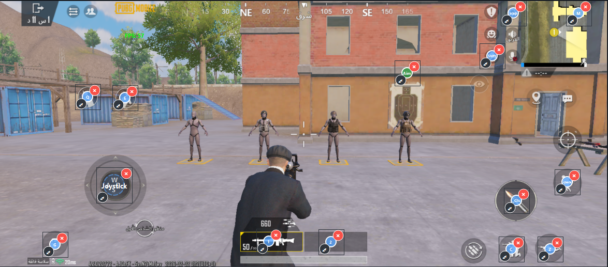
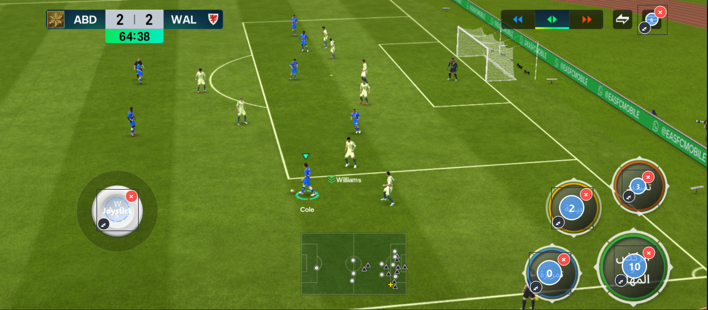

# صفحة هبوط Mirror Flow 🚀

يحتوي هذا المجلد على ملفات واجهة الويب الخاصة ببرنامج **Mirror Flow** - الأداة الأقوى لعكس الشاشة وتخطيط الأزرار.

## 📱 نظرة عامة
تجمع هذه الصفحة بين التصميم العصري (Dark Mode) وتأثيرات الزجاج (Glassmorphism) لتقديم البرنامج للمستخدمين بشكل احترافي، مع استعراض كامل للميزات التقنية مقارنة بالبرامج المنافسة.

## 📂 محتويات المجلد
- `index.html`: الصفحة الرئيسية (معرض الصور، جدول المقارنة، والأسئلة الشائعة).
- `index.css`: نظام التنسيق والتصميم الكامل.
- `updates.html`: سجل التحديثات والإصدار v1.0.0.
- `README.md`: هذا الملف الإرشادي.

## 🖼️ معاينة الواجهة (صور من البرنامج)

### استعراض تخطيط أزرار الكيبورد (PUBG)

### استعراض دعم الدرعات (FIFA)

### محرر الأزرار الذكي

## 🛠️ كيفية الاستخدام
لرفع الصفحة على استضافة ويب:
1. ارفع مجلد `page` بالكامل.
2. تأكد من وجود الصور المرفقة في نفس المجلد لتعمل المعاينة بشكل صحيح.
3. الصفحة جاهزة للعمل على الجوال والحاسوب (Responsive).

## 👨‍💻 المطور
بكل فخر.. صنع بأيدي مطور عربي واحد.
**Mirror Flow: ابتكار عربي.. طموح عالمي.**
